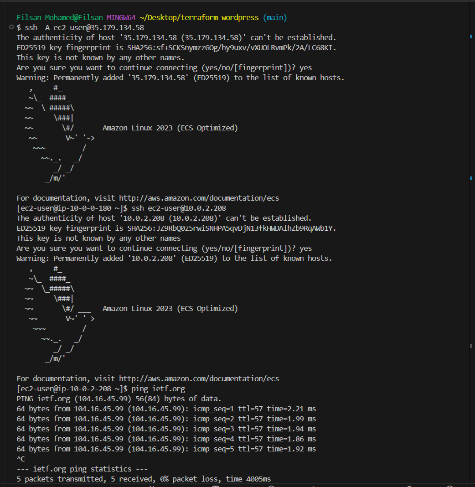
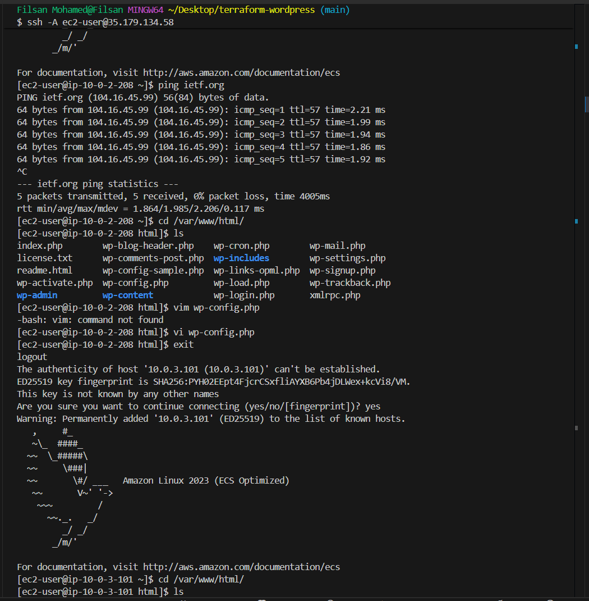
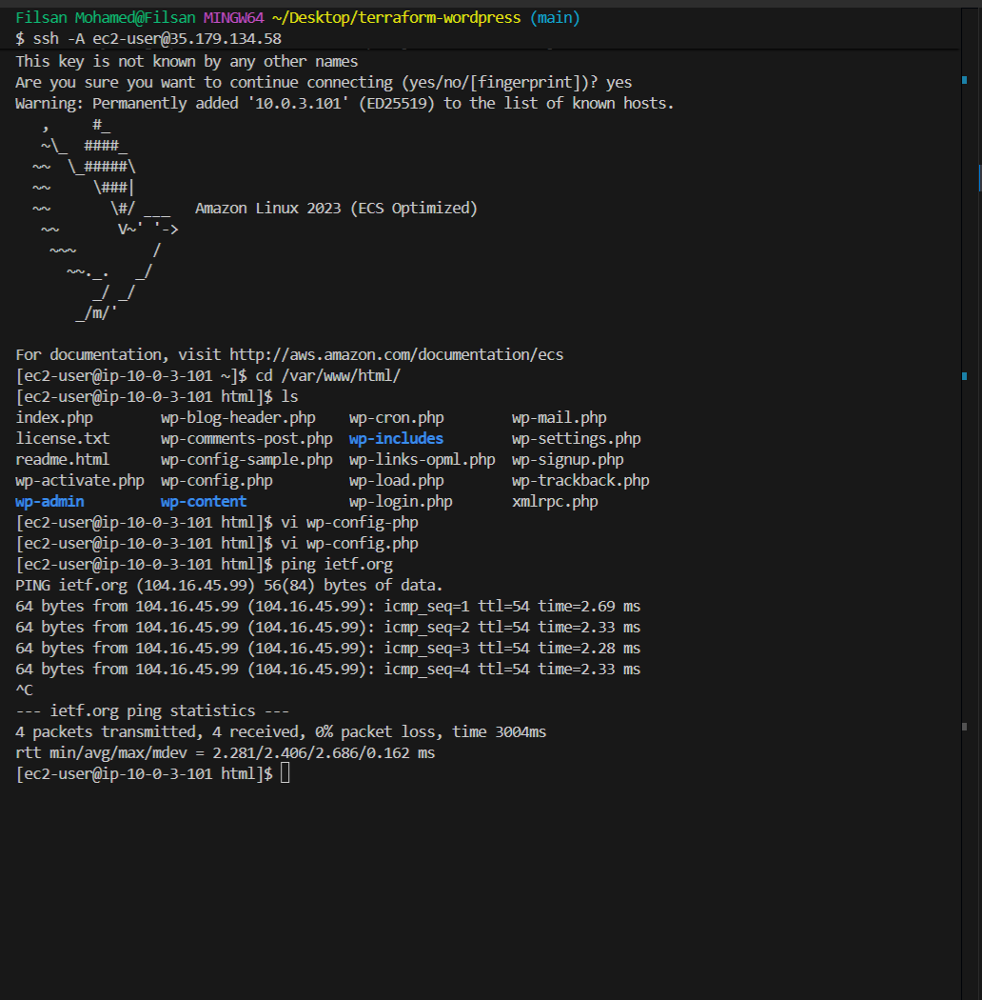
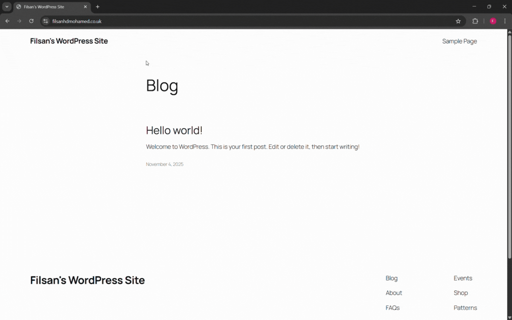
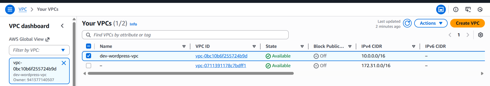
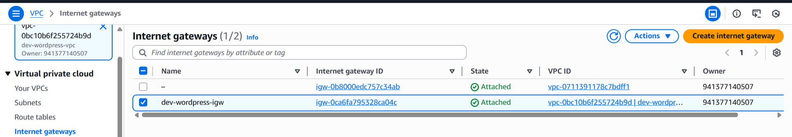
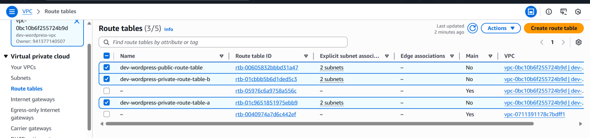
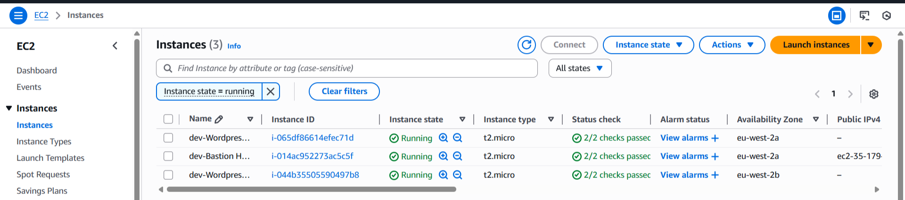
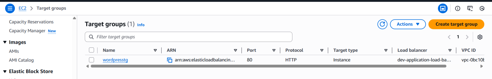
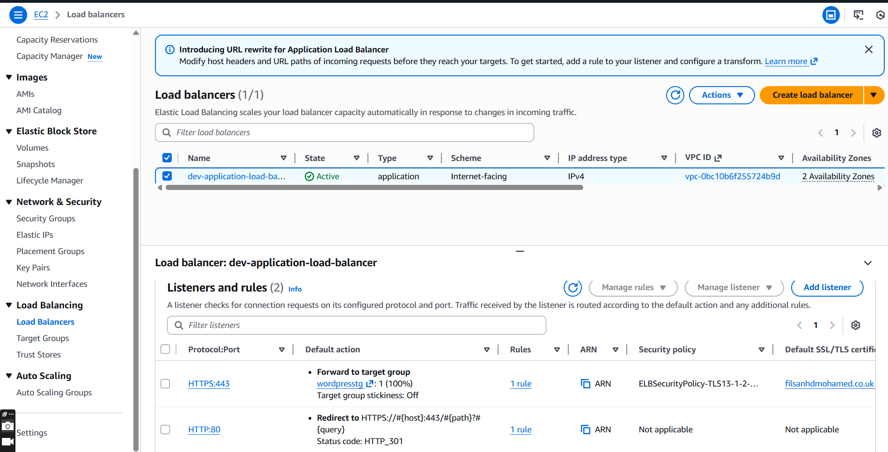

# Terraform-Wordpress-AWS
<br>
<br>

## 📄 Project Description
<br>
<br>

This Terraform project automates the deployment of a highly available Wordpress website on AWS. It provisions a VPC with 2 public subnets and 4 private subnets across 2 Availability Zones, including NAT Gateways for private instance instance internet access. The architecture consists of:

- A Bastion host for secure SSH access

- Two private EC2 instances running Wordpress (configured via cloud-init and a custom wordpress.tpl template)

- An RDS MySQL database in private subnets with multi-AZ support

- The Application Load Balancer (ALB) redirects all HTTP traffic to HTTPS and uses an SSL/TLS certificate from AWS Certificate Manager (ACM) to encrypt traffic between users and the site.

- Using Terraform, Route 53 automatically creates an alias record for filsanhdmohamed.co.uk pointing to the Application Load Balancer (ALB) and adds the DNS records needed for AWS Certificate Manager (ACM) to validate the SSL/TLS certificate, ensuring the WordPress site is served securely over HTTPS.

- Security groups enforcing least-privilege access: Application Load Balancer (ALB) is open to the internet on port 80 and 443, WordPress instances are reachable only by the Application Load Balancer (ALB) and Bastion, RDS is accessible only by WordPress, and the Bastion-host is restricted to a trusted IP.
<br>
<br>
---
<br>
<br>

## Architecture Diagram

<br>


<br>

---

## 📁 Terraform Wordpress Project Structure

```

terraform-wordpress/
│
├── modules/
│   ├── EC2/
│   │   ├── main.tf
│   │   ├── outputs.tf
│   │   ├── variables.tf
│   │   └── wordpress.tpl
│   │
│   ├── acmroute53/
│   │   ├── main.tf
│   │   ├── outputs.tf
│   │   └── variables.tf
│   │
│   ├── alb/
│   │   ├── main.tf
│   │   ├── outputs.tf
│   │   └── variables.tf
│   │
│   ├── rds/
│   │   ├── main.tf
│   │   ├── outputs.tf
│   │   └── variables.tf
│   │
│   ├── security/
│   │   ├── main.tf
│   │   ├── outputs.tf
│   │   └── variables.tf
│   │
│   └── vpc/
│       ├── main.tf
│       ├── outputs.tf
│       └── variables.tf
│
├── .gitignore
├── .terraform.lock.hcl
├── main.tf
├── outputs.tf
├── provider.tf
└── variables.tf

```
---
<br>

### SSh'd into Wordpress App A (which Wordpress instance in the private subnet in Availability Zone A)through the Bastion Host instance in the public subnet.
<br>

Checked whether the wp-config.php file had been modified so that wordpress can connect to the RDS database. Also tested from the Wordpress private instance, whether it was possible to connect to the internet by running the ping command for a website (ietf.org) that has ICMP enabled. Used the command: `ping ietf.org` . As you can see in the pictures below, the wordpress app in the private subnet is able to establish a connection with the internet through the NAT Gateway. 

Did all the above for Wordpress App B as well, which had the same results, as you can see below.

<br>



<br>
<br>



<br>
<br>



<br>
<br>
---

<br>

### DEMO WORDPRESS WEBSITE
<br>
<br>



<br>
<br>
---
<br>

### Below you can see what the terraform code created in the AWS management console.
<br>
<br>

#### VPC
 <br>



<br>
---
<br>

### Subnets
<br>


<br>

---

<br>

### Internet Gateway

<br>



<br>

---
<br>

### Route Tables

<br>



<br>

---
<br>

### Nat Gateways

<br>


<br>

---
<br>

### EC2

<br>



<br>

---

<br>

### Target group

<br>



<br>

---
<br>

### Application Load Balancer

<br>



<br>

---
<br>
<br>


### Documentation resources:  
<a href="https://registry.terraform.io/" style="color: blue; text-decoration: underline;">Terraform Registry</a>  
<a href="https://developer.hashicorp.com/terraform" style="color: blue; text-decoration: underline;">Hashicorp Terraform</a>


